# How the Testing Skill Works

This diagram shows the complete testing workflow from feature request to human review.

```mermaid
---
config:
  theme: base
  themeVariables:
    fontSize: 18px
    primaryColor: "#e0e0e0"
    primaryTextColor: "#000000"
    primaryBorderColor: "#666666"
    lineColor: "#333333"
    secondaryColor: "#f5f5f5"
    tertiaryColor: "#eeeeee"
---
flowchart LR
    subgraph Input["👤 INPUT"]
        SPEC[Feature Spec /<br>Request]
    end

    subgraph Planning["🤖 PLANNING PHASE"]
        CTX[Test Context<br>Folder Created]
        PLAN[test-plan.md]
    end

    subgraph Skeleton["🤖 SKELETON PHASE"]
        SKEL[Build Page<br>Skeleton]
    end

    subgraph Analysis["🤖 ANALYSIS PHASE"]
        PAGE[page-analysis.md]
    end

    subgraph Coding["🤖 CODING PHASE"]
        direction TB
        WRITECODE[Write Code]
        WRITETESTS[Write Tests]

        subgraph Tools["Helper Tools & Agents"]
            COV[Coverage MCP]
            PW[Playwright MCP]
            HEAL[testskill.healer]
            FIX[testskill.locator-fixer]
        end
    end

    subgraph Verification["🤖 VERIFICATION"]
        TV[testskill.verifier]
    end

    subgraph Review["👤 REVIEW"]
        HR[Human Review]
    end

    SPEC --> CTX
    CTX --> PLAN
    PLAN --> SKEL
    SKEL --> PAGE
    PAGE --> Coding

    WRITETESTS <-.-> COV
    WRITETESTS <-.-> PW
    WRITETESTS <-.-> HEAL
    WRITETESTS <-.-> FIX

    Coding --> Verification
    Verification --> HR
```

## Workflow Summary

| Phase            | Key Activities                                                       | Outputs             |
| ---------------- | -------------------------------------------------------------------- | ------------------- |
| **Input**        | Feature spec or request arrives                                      | Requirements        |
| **Planning**     | testskill.planner creates context folder, measures baseline coverage | `test-plan.md`      |
| **Analysis**     | testskill.page-analyzer inspects page elements, network, ARIA        | `page-analysis.md`  |
| **Coding**       | Write tests using plan + analysis, assisted by tools                 | Test files          |
| **Verification** | testskill.verifier checks quality, coverage, best practices          | Verification report |
| **Review**       | Human reviews and approves                                           | Final approval      |

## The Double Gate Principle

The workflow enforces two mandatory gates:

1. **Entry Gate**: Test planning is the **first task** in any feature workflow
2. **Exit Gate**: Test verification is the **last task** before completion

No coding session should happen without passing through both gates.
