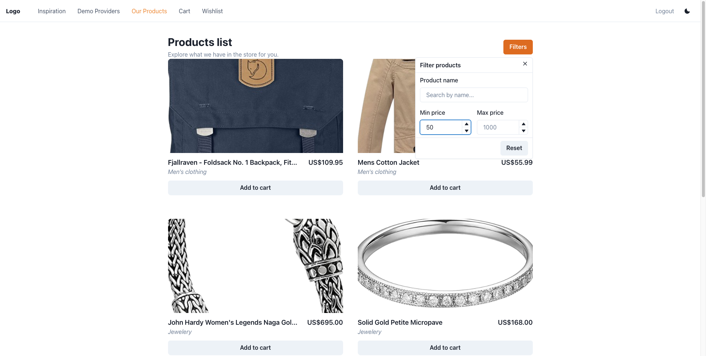
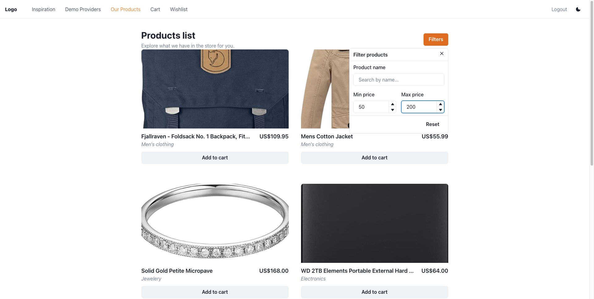

# Products Filter Feature - Page Analysis

## Executive Summary

**Testability: EXCELLENT** - This feature is highly testable with proper ARIA attributes, clean component architecture, and client-side filtering logic. All interactive elements are accessible via semantic roles and labels. No blockers identified.

The filter feature demonstrates good accessibility practices with proper ARIA labeling on all inputs and buttons. The component is well-structured with separation of concerns between presentation (ProductsFilter.tsx) and business logic (use-products-filter.ts hook).

## Navigation

**Route**: Navigate to `/products` (http://localhost:5173/products)

**Interaction path**:

1. Click the "Filters" button in the PageHeader section
2. The filter popover opens with all filter controls

## Snapshot

### Initial State - Filters Popover Open


### Filter by Name - "cotton"


### Filter by Min Price - $50



### Filter by Price Range - $50-$200



## Key Elements

| Element            | Has ARIA | Selector Example                                   | Notes                                           |
| ------------------ | -------- | -------------------------------------------------- | ----------------------------------------------- |
| Filters button     | Yes      | `getByRole('button', { name: 'Filters' })`         | Changes color to orange when filters active     |
| Close button       | Yes      | `getByRole('button', { name: 'Close' })`           | In popover header                               |
| Product name input | Yes      | `getByRole('textbox', { name: 'Product name' })`   | Has placeholder "Search by name..."             |
| Min price input    | Yes      | `getByRole('spinbutton', { name: 'Min price' })`   | NumberInput with stepper controls               |
| Max price input    | Yes      | `getByRole('spinbutton', { name: 'Max price' })`   | NumberInput with stepper controls               |
| Reset button       | Yes      | `getByRole('button', { name: 'Reset' })`           | Clears all filters                              |
| Filter popover     | Yes      | `getByRole('dialog', { name: 'Filter products' })` | Main popover container                          |
| Increment buttons  | No       | Generic buttons without labels                     | In NumberInput steppers - accessibility warning |
| Decrement buttons  | No       | Generic buttons without labels                     | In NumberInput steppers - accessibility warning |

**Accessibility Warnings**:

- The NumberInput increment/decrement stepper buttons lack aria-labels, making them hard to identify for screen readers
- These are Chakra UI components, so this may be a framework limitation

## Console Errors

**None** - No console errors detected during interaction with the filter feature.

Console messages observed (informational only):

- React DevTools download suggestion
- i18next initialization and language change logs
- These are expected development messages, not errors

## Aria Snapshot

```yaml
- button "Filters" [expanded] [cursor=pointer]
- dialog "Filter products" [active]:
    - generic: Filter products
    - button "Close" [cursor=pointer]:
        - img
    - generic:
        - group:
            - generic: Product name
            - textbox "Product name":
                - /placeholder: Search by name...
        - generic:
            - group:
                - generic: Min price
                - generic:
                    - spinbutton "Min price"
                    - generic:
                        - button [cursor=pointer]: # INCREMENT - NO ARIA LABEL
                            - img
                        - button [cursor=pointer]: # DECREMENT - NO ARIA LABEL
                            - img
            - group:
                - generic: Max price
                - generic:
                    - spinbutton "Max price"
                    - generic:
                        - button [cursor=pointer]: # INCREMENT - NO ARIA LABEL
                            - img
                        - button [cursor=pointer]: # DECREMENT - NO ARIA LABEL
                            - img
    - button "Reset" [cursor=pointer]
```

## Implementation

### Files

**Presentation Layer**:

- `/Users/goldbergyoni/solutions/frontend-testing-setup/example-app/src/features/products/presentation/ProductsFilter.tsx` (117 lines)
  - React component that renders the filter UI using Chakra UI Popover
  - Receives filters state and setters as props
  - Handles user input events and updates filter state
  - Uses i18n for all labels

**Application Layer**:

- `/Users/goldbergyoni/solutions/frontend-testing-setup/example-app/src/features/products/application/use-products-filter.ts` (51 lines)
  - Custom hook managing filter state and logic
  - Provides `filters`, `setFilters`, `resetFilters`, `hasActiveFilters`
  - Returns `filteredProducts` computed via useMemo
  - Client-side filtering with case-insensitive name matching

**Page Integration**:

- `/Users/goldbergyoni/solutions/frontend-testing-setup/example-app/src/pages/Products/Products.browse1.test.tsx`
  - Example browser test showing MSW setup and page testing patterns

### Summary

**Filter Logic**: Client-side filtering using `Array.filter()` with three conditions:

1. **Name filter**: Case-insensitive substring match on `product.title`
2. **Min price**: Filters products where `price >= minPrice`
3. **Max price**: Filters products where `price <= maxPrice`

**State Management**: Uses React `useState` for filter state, `useMemo` for performance optimization of filtered results.

**UI Patterns**:

- Chakra UI Popover for the filter dialog
- NumberInput components with increment/decrement steppers
- Button color changes (orange) when filters are active
- Reset button clears all filters to default values

**Key Behavior**:

- Filtering happens immediately as user types or changes values
- Empty/null values are treated as "no filter" for that criterion
- All filters work together (AND logic - all conditions must match)
- No network requests - purely client-side filtering

## Network

**Key requests**:

- `GET https://fakestoreapi.com/products?limit=10&sort=asc` - Initial product load
- `GET https://fakestoreapi.com/users/1` - User data
- `GET http://localhost:5173/locales/en-GB/translation.json` - i18n translations

**Filter behavior**:

- **No network requests during filtering** - All filtering is client-side
- Products are fetched once on page load
- Filter operations are purely in-memory transformations

**HAR file**: Not generated (filtering is client-side only, no additional network activity)

## Working Folder

`/Users/goldbergyoni/solutions/frontend-testing-setup/example-app/test/context/products-filter-feature-01/`

## Recommendations

1. **Accessibility Improvement**: Consider adding aria-labels to NumberInput stepper buttons, though this may require customizing Chakra UI components or filing an upstream issue.

2. **Test Coverage Areas**:

   - Name filter (case-insensitive, partial match)
   - Min price filter (boundary values)
   - Max price filter (boundary values)
   - Combined filters (name + price range)
   - Reset functionality
   - Visual feedback (button color change when filters active)
   - Empty state when no products match filters

3. **Edge Cases to Test**:
   - Filtering with no results
   - Invalid price inputs (negative, non-numeric)
   - Filter persistence when popover closes
   - Reset clears all filters correctly
