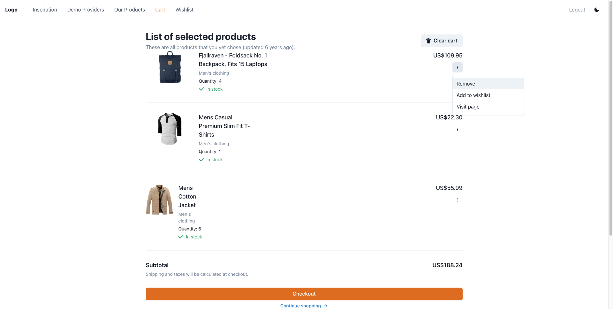
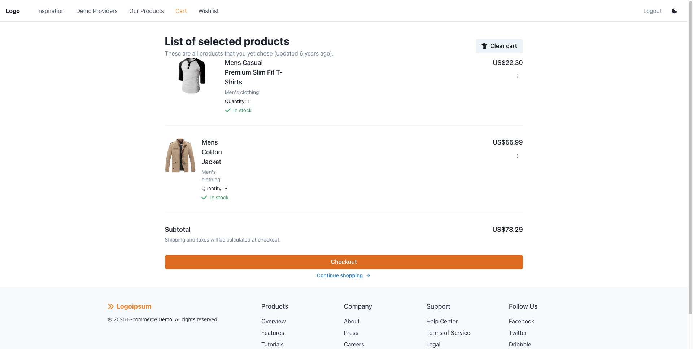
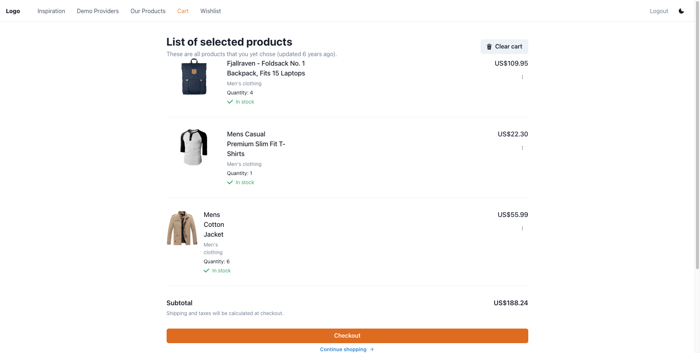

# 🛒 Page Analysis: Shopping Cart - Product Removal & Wishlist Test Plan

## 📋 Executive Summary

The Shopping Cart page (`/cart/1`) is **fully testable**. All key interactions for product removal and adding to wishlist are accessible via proper ARIA attributes (regions, buttons, menu items, alerts). The page uses optimistic updates for smooth UX, and success notifications confirm user actions. No blockers identified for the focused scenarios.

---

## 🗺️ How to Reach the Target View

1. **Direct Route**: Navigate to `http://localhost:5173/cart/1`
2. **Authentication Required**: User must be authenticated (handled by `withRequireAuth` HOC)
3. **Alternative Path**: Click "Cart" link in the navigation header from any authenticated page

---

## 📸 Snapshot


---

## 🎯 Key Elements Table

| Element                    | ARIA Support                         | Selector Example                                                                                   |
| -------------------------- | ------------------------------------ | -------------------------------------------------------------------------------------------------- |
| Product region             | ✅ `role="region"` with `aria-label` | `getByRole('region', { name: 'Fjallraven - Foldsack No. 1 Backpack, Fits 15 Laptops' })`           |
| Product actions button     | ✅ `aria-label="Product actions"`    | `getByRole('button', { name: 'Product actions' })`                                                 |
| Remove from cart menu item | ✅ `aria-label="Remove from cart"`   | `getByRole('menuitem', { name: 'Remove from cart' })`                                              |
| Add to wishlist menu item  | ✅ `aria-label="Add to wishlist"`    | `getByRole('menuitem', { name: 'Add to wishlist' })`                                               |
| Success notification alert | ❌ NO stable locator                 | `document.querySelector('div[data-status="success"] > div:nth-child(2) > div.chakra-alert__desc')` |
| Cancel button (dialog)     | ✅ Accessible name                   | `getByRole('button', { name: 'Cancel' })`                                                          |
| Checkout button            | ✅ Accessible name                   | `getByRole('button', { name: 'Checkout' })`                                                        |

---

## 📁 Working Folder Path

```
src/test/.test-plan/shopping-cart/
```

---

## ⚠️ Console Errors

| Error                          | Description                                                                                                                              |
| ------------------------------ | ---------------------------------------------------------------------------------------------------------------------------------------- |
| `Failed to load resource: 404` | `https://cart-service.shopy.com/carts/1/products/1` - API endpoint for DELETE doesn't exist on fake store API (expected in mocked tests) |
| `Ajax error occurred`          | Error during removing item from cart - related to above 404                                                                              |

**Note**: These errors are expected in development since the fake store API doesn't support DELETE operations. Tests use MSW to mock these endpoints.

---

## 🏗️ Implementation Summary and Files

### Screen Logic Summary

The Cart page displays products from the user's cart fetched via `useCartProductsQuery`. Each product is rendered as a `CartItem` component with an actions menu. The key flows are:

1. **Remove from cart**: Uses `useRemoveFromCart` hook which performs optimistic update (removes from React Query cache immediately) then fires DELETE API in background
2. **Add to wishlist**: Uses `useWishlistStore` (Zustand with localStorage persistence) to add product to wishlist - purely client-side state
3. **Clear cart**: Shows confirmation dialog via `useConfirmClearCartDialogStore`, then calls `useClearCart` hook

### Key Implementation Files

| File                                                                  | Purpose                                                  |
| --------------------------------------------------------------------- | -------------------------------------------------------- |
| `src/pages/Cart/index.tsx`                                            | Page component composing CartsList with ClearCartButton  |
| `src/features/carts/presentation/CartItem.tsx`                        | Product item with actions menu (remove, wishlist, visit) |
| `src/features/carts/presentation/CartsList.tsx`                       | List component rendering CartItem components             |
| `src/features/carts/infrastructure/useRemoveFromCart.ts`              | Hook for optimistic removal with API call                |
| `src/features/wishlist/infrastructure/useWishlistStore.ts`            | Zustand store for wishlist (persisted to localStorage)   |
| `src/features/carts/presentation/ClearCartButton/ClearCartButton.tsx` | Clear cart with confirmation dialog                      |
| `src/lib/api/carts/{cart-id}/remove-from-cart-command.ts`             | API command for removal                                  |
| `src/test-lib/helpers/cart-browser-helpers.tsx`                       | Test helpers for cart page testing                       |

---

## ✅ Proposed Test Cases

Based on the focus on **product removal** and **moving to wishlist**:

### 1. When removing a product from cart, then the product disappears and success notification shows

**Simulation**:

- Arrange: Set up cart with 2 products via MSW
- Act: Click product actions → Click "Remove from cart"
- Assert: Product region no longer visible, alert "Removed from cart successfully" visible

### 2. When removing a product from cart, then DELETE API is called with correct parameters

**Simulation**:

- Arrange: Set up cart with products, spy on DELETE endpoint
- Act: Click product actions → Click "Remove from cart"
- Assert: DELETE request made to `/carts/{cartId}/products/{productId}`

### 3. When adding a product to wishlist, then success notification shows

**Simulation**:

- Arrange: Set up cart with product
- Act: Click product actions → Click "Add to wishlist"
- Assert: Alert "Added to wishlist successfully" visible

### 4. When adding a product to wishlist, then product appears in wishlist store

**Simulation**:

- Arrange: Set up cart with specific product, clear wishlist localStorage
- Act: Click product actions → Click "Add to wishlist"
- Assert: Product exists in wishlist (check localStorage or navigate to /wishlist)

### 5. When removing the last product from cart, then cart shows empty state and subtotal updates

**Simulation**:

- Arrange: Set up cart with 1 product
- Act: Click product actions → Click "Remove from cart"
- Assert: No product regions visible, subtotal shows $0 or empty message

---

## 🌐 Key Network Requests

| Method | URL                                                                  | Description                      |
| ------ | -------------------------------------------------------------------- | -------------------------------- |
| GET    | `https://cart-service.shopy.com/carts/1`                             | Fetch cart data                  |
| GET    | `https://cart-service.shopy.com/users/1`                             | Fetch user data (for auth)       |
| GET    | `https://cart-service.shopy.com/products/{id}`                       | Fetch product details (1, 2, 3)  |
| DELETE | `https://cart-service.shopy.com/carts/{cartId}/products/{productId}` | Remove product (mocked in tests) |

**Note**: No HAR file was captured as network requests were minimal and documented above.

---

## 📷 Additional Screenshots

| Screenshot                                                 | Description                                                   |
| ---------------------------------------------------------- | ------------------------------------------------------------- |
|         | Actions menu with Remove, Add to wishlist, Visit page options |
|             | Cart after product removal with updated subtotal              |
|           | Success notification after adding to wishlist                 |
|  | Confirmation dialog for clearing entire cart                  |

---

## 🔍 ARIA Snapshot

```yaml
- main:
    - generic (header):
        - heading "List of selected products" [level=2]
        - button "Clear cart"
    - generic (product list):
        - region "Fjallraven - Foldsack No. 1 Backpack, Fits 15 Laptops":
            - paragraph: Product title (clickable)
            - paragraph: Category
            - paragraph: "Quantity: 4"
            - paragraph: "In stock"
            - paragraph: Price
            - button "Product actions" → menu:
                - menuitem "Remove from cart"
                - menuitem "Add to wishlist"
                - menuitem "Visit product page"
        - separator
        - region "Mens Casual Premium Slim Fit T-Shirts": (same structure)
        - separator
        - region "Mens Cotton Jacket": (same structure)
        - separator
        - generic (subtotal):
            - paragraph: "Subtotal"
            - paragraph: Price total
        - button "Checkout"
        - button "Continue shopping"
    - region "Notifications-bottom": (toast container)
```
